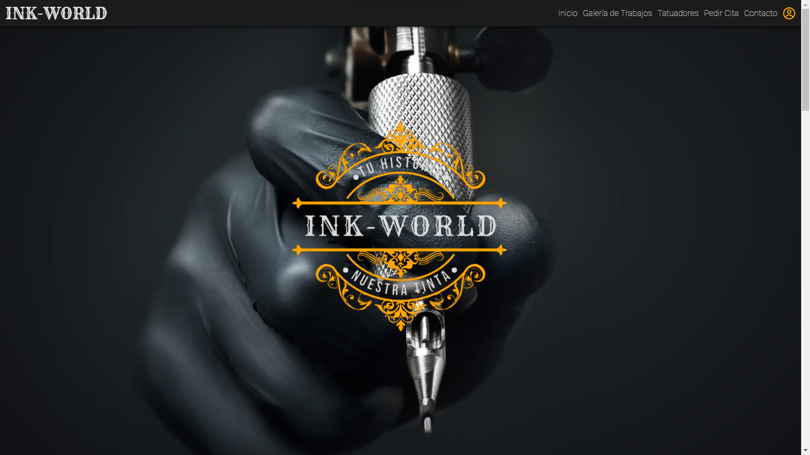
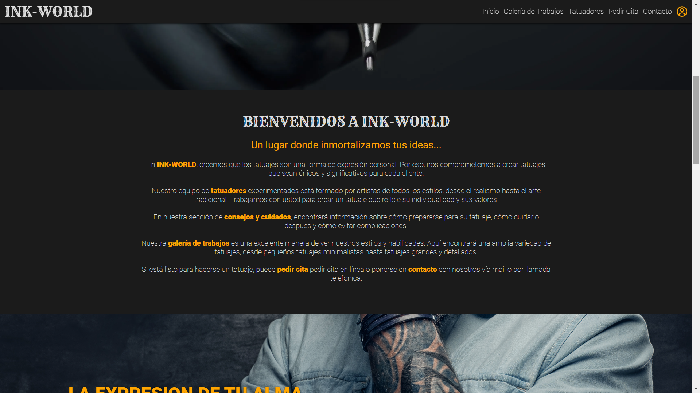
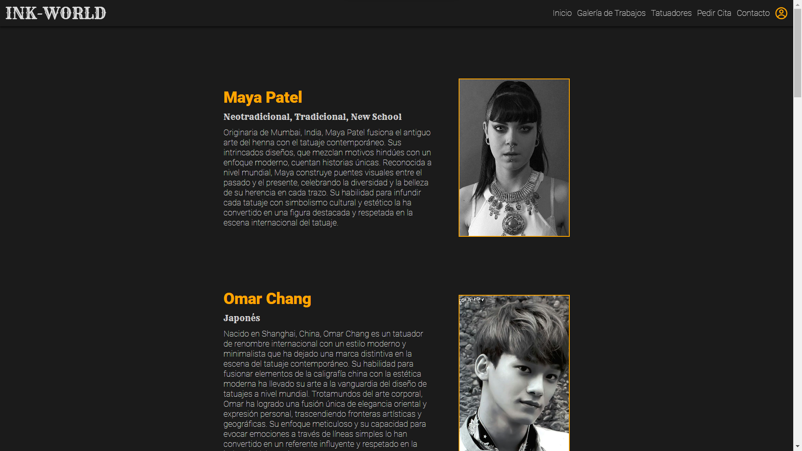
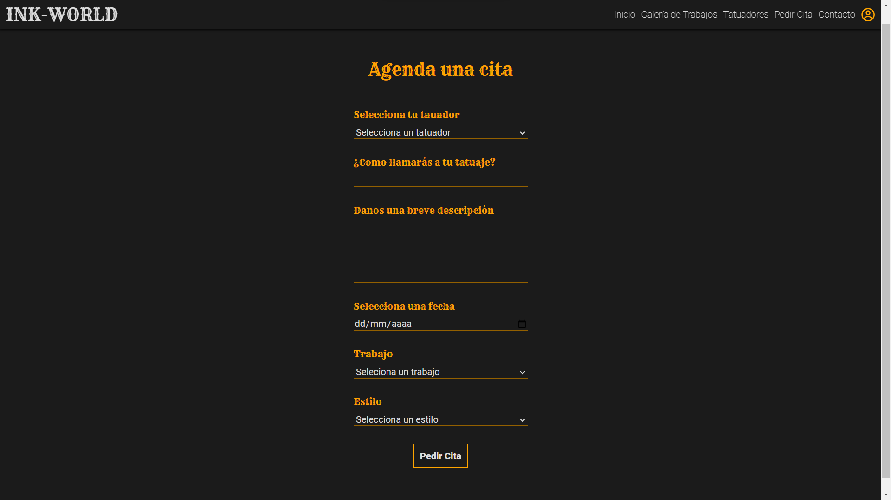
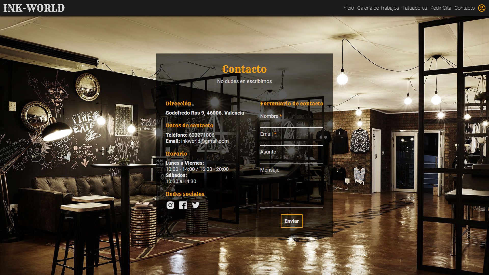
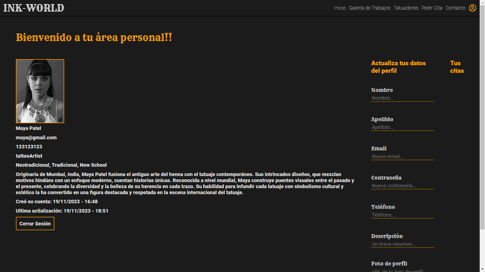
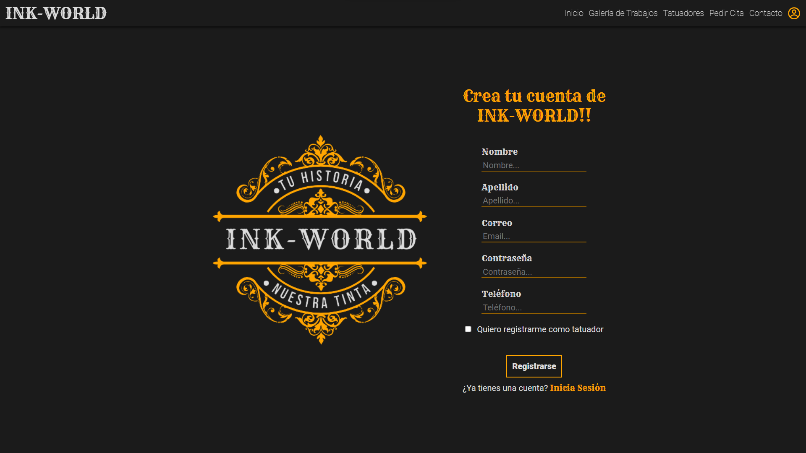
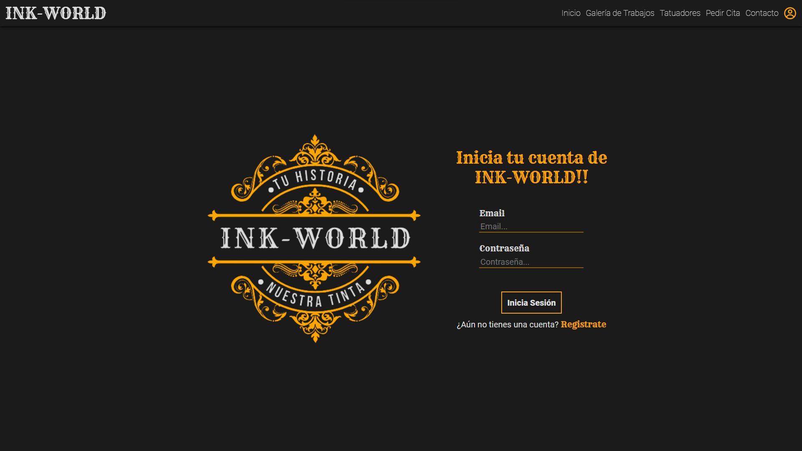
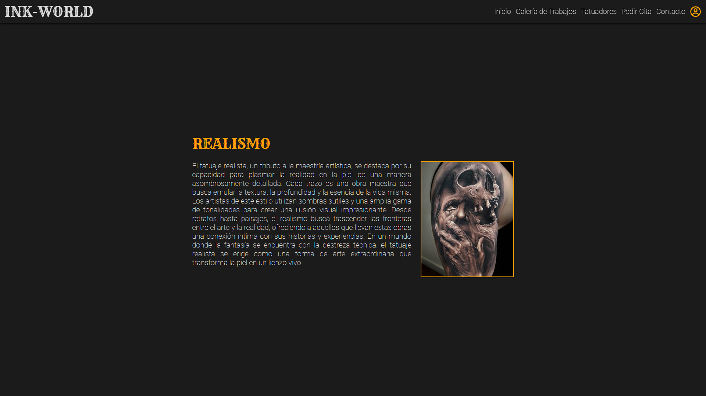
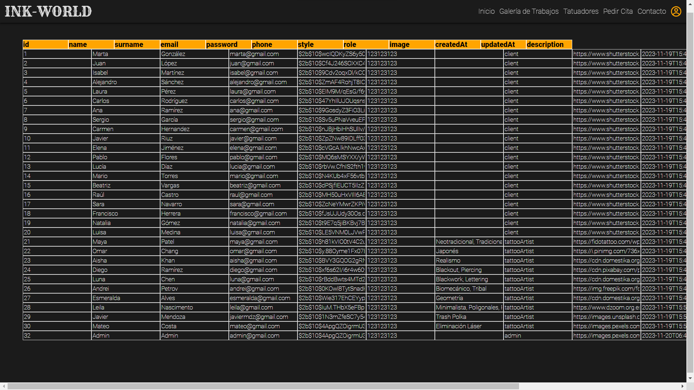

<h1 align="center">INK-WORLD</h1>

**
Proyecto 5 de GeeksGubs Academy
**

**
Repositorio del proyecto: https://github.com/Gaston-Valentini/proyect5-ink-world
**

Desarrollo full-stack de INK-WORLD, by Gastón Valentini.
 
Desarrollado como parte del Bootcamp de Full Stack Developer de Geekshubs Academy.

   

      
   
    
</>

**INK-WORLD** es el resultado final de combinar el backend relaizado en el proyecto 4, con algunas modificaciones para mejorarlo, y la creación de un nuevo frontend con React, obteniendo como resultado una aplicación full-stack.

   

      
   
    

##📋Tabla de contenidos

  
Apartados

<ol>
    <li><a href="#objetivo">Objetivo</a></li>
    <li><a href="#contenido-del-proyecto">Contenido del proyecto</a></li>
    <li><a href="#diseño-responsive">Diseño responsive</a></li>
    <li><a href="#tecnologías-utilizadas">Tecnologías utilizadas</a></li>
    <li><a href="#instrucciones-de-uso">Instrucciones de Uso</a></li>
    <li><a href="#futuras-funcionalidades">Futuras funcionalidades</a></li>
  </ol>

##🎯Objetivo

El objetivo de este proyecto es demostrar los conocimientos adquiridos en las 10 primeras semanas del bootcamp de GeeksHubs Academy, mediante el desarrollo de una aplicación web SPA, desarrollando tanto su backend, como su frontend. La aplicación se trata del diseño de una página web de un estudio de tatuajes ficticio, donde además de contenido relacionado con el mundo del tatuaje, se podrán registrar clientes, tatuadores, y pedri citas, además de un panel de administrador.

##📓Contenido del Proyecto

Vistas de las que está constituida la página.

1. **INICIO**: Página principal de bienvenida, se podrá ver información del estudio y enlaces a las demás vistas.

   

      
   

2. **GALERÍA DE TRABAJOS**: Muestra algunos de los trabajos realizados por los artistas, en forma de galería y cada uno tiene su estilo y su tatuador. La galería está almacenada en la base de datos..

   

      
   

3. **TATUADORES**: En esta vista se podrán observar los tatuadores registrados en la base de datos, con su nombre, sus estilos y una pequeña biografía de cada uno.

   

      
   
  

4. **PEDIR CITA**: Como su nombre indica, en esta vista se podrá pedir una cita, eligiendo diversos aspectos como, el tatuador, estilo, tipo de intervención y más. Esta ruta está protegida, por lo que deberá iniciar sesión para pedir una cita.

   

      
   
 

5. **CONTACT**: Se trata de una vista en la que se simula un formulario de contacto, junto con enlaces a las redes sociales.

   

      
   
 

6. **PROFILE**: Aquí es donde se encuentra almacenada toda la información del usuario, donde se podrá editar la misma, y donde se verán el historial de citas pendientes junto con los detalles de la cita. También podrá cerrar la sesión de su cuenta.

   

      
   
 

7. **LOGIN Y REGISTER**: La aplicación carecería de sentido sin estas vistas, dedicadas a registrar usuarios y a iniciar sesión.

   

      
   

   

      
   
 

8. **TATTOO STYLE**: Como se mencionó, en el inicio se podrá acceder a una vista en la cual se detalla cada estilo de tatuajes por si el ususario desea inspirarse y no sabe que trabajo desea.

   

      
   
   

9. **ADMIN**: Esta es una vista especial, dedicada al administrador del sistema y solo accesible para el, en la cual se detallan todos los usuarios almacenados en la base de datos, donde se podrá modificar su información y eliminar el usuario en cuestión.

   

      
   

   

      
   

##🎨 Diseño Responsive

Todo el diseño del sitio web es responsive, lo que significa que se adapta a diferentes dispositivos y tamaños de pantalla gracias al uso de display flex y de media querys. Esto garantiza una experiencia de usuario óptima tanto en computadoras de escritorio como en dispositivos móviles.

##🔧Tecnologías Utilizadas

Tecnologías.

-   **React**: Se utilizó en el desarrollo del frontend, garantizando un buend desarrollo Single Page Aplication.

-   **Express**: Es el encargado de desarrollar el servidor y manejar las consultas mediante un Modelo Vista Controlador.

-   **MySQL**: Es la base de datos elegida para el almacenamiento de los mediante tablas relacionadas.

-   **GitHub y Git**: Con este par manejamos el control de versiones y almacenamiento en la nube de nuestra aplicación.

Instrucciones.

1. Clona este repositorio en tu máquina local usando el siguiente comando: `git clone [URL del repositorio]`.

2. Accede a la carpeta server con el comando `cd server`.

3. Ejecuta el comando `npm install` para instalar las dependencias necesarias.

4. Crea un archivo .env con las variables de entorno ejemplificadas en el archivo .env.example y coloca los valores que desees.

5. Ejecuta el comando `npm run dev` para correr el servidor de manera local.

6. Repite el proceso en la carpeta client.

7. Visita el navegador localhost en el puerto que hayas seleccionado.
 

##🚄 Futuras Funcionalidades

-   Vista de admin de portfolio, estilos y appointments: Una vista para que el admin sea capaz de acceder a los datos almacenados perteneciemtes al resto de tablas, como gallery, tattooStyles y appointments.

-   Mejora de diseño: Mejorar el diseño responsivo de admin y la estética general de la página con detalles más atractivos.

-   Mejora en Pedir Cita: Mejorar la creación de citas permitiendo al usuario crear citas eligiendo primero al tatuador y en base a ello los estilos que este tatuador controla y los días que estén disponibles.
